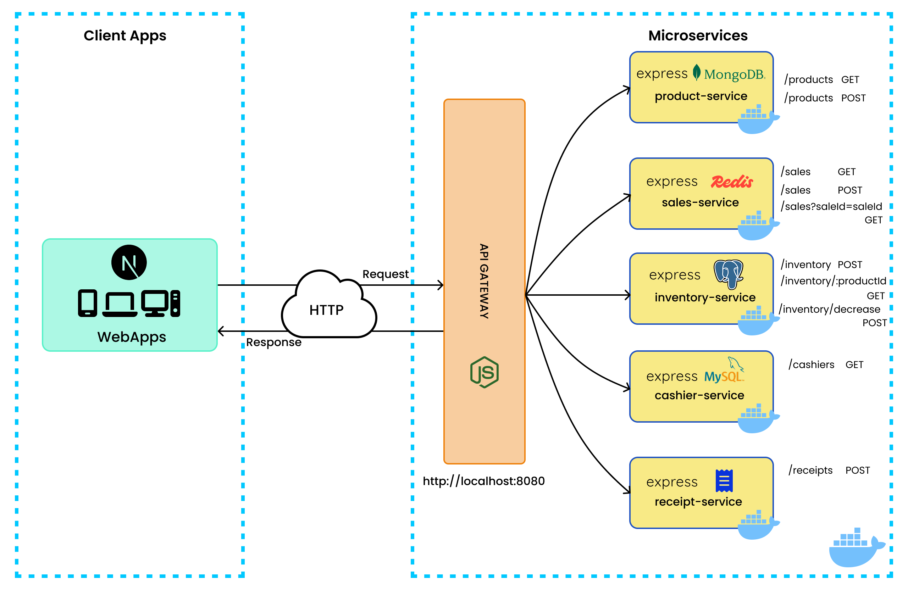

# 🛒 POS-Mi API - Point of Sale Microservices System 

---

## 🧠 Project Overview

**POS-Mi API** adalah backend berbasis *microservices* untuk sistem kasir (Point of Sale) modern. Sistem ini dibangun dengan pendekatan arsitektur terdistribusi untuk memastikan skalabilitas, kemudahan pengelolaan, serta fleksibilitas pengembangan tiap layanan secara independen.

Proyek ini ditujukan sebagai fondasi sistem POS berbasis web yang efisien dan modular, dengan setiap layanan menangani satu tanggung jawab spesifik, serta komunikasi antar layanan dimediasi oleh API Gateway.

---

## ✨ Key Features

- 🚪 **API Gateway** untuk pengaturan lalu lintas request ke tiap service.
- 📦 **Product Service (MongoDB)** untuk manajemen produk.
- 🧮 **Inventory Service (Redis)** untuk pengelolaan stok real-time.
- 💰 **Sales Service (PostgreSQL)** untuk pencatatan transaksi penjualan.
- 🧾 **Receipt Service** untuk menyimpan data struk digital.
- 🧑‍💼 **Cashier Service (PostgreSQL)** untuk login kasir.
- 🐳 **Dockerized** untuk kemudahan deployment dengan Docker Compose.

---

## 🖼️ API Microservices Architecture Preview



---

## 🏗️ Architecture & Tech Stack

| Layer        | Tools & Frameworks                           |
|--------------|----------------------------------------------|
| **Gateway**     | Express.js, http-proxy-middleware             |
| **Services**    | Express.js (Node.js)                         |
| **Database**    | MongoDB, Redis, PostgreSQL                   |
| **Container**   | Docker, Docker Compose                      |
| **Logging**     | Morgan (dev logger)                          |
| **CORS**        | Express CORS Middleware                      |

---

## 🌐 API Gateway Behavior

API Gateway berfungsi sebagai gerbang utama yang menerima semua permintaan dari frontend dan meneruskannya ke service backend yang sesuai. Setiap permintaan diperiksa berdasarkan awalan path (prefix), lalu diarahkan ke alamat service yang dikonfigurasi di `.env`.

Contoh:
- `GET /products` → diteruskan ke `product-service`
- `POST /sales` → diteruskan ke `sales-service`

Middleware:
- `http-proxy-middleware` → untuk forwarding request
- `cors()` → mengaktifkan akses lintas domain
- `morgan('dev')` → mencatat setiap request yang masuk

---

## 📘 API Endpoints & Frontend Interactions

### ✅ 1. Product Service (MongoDB)

- **POST /products** → Tambah produk
- **GET /products** → Ambil seluruh produk

**Contoh Request:**
```json
{
  "id": "prod-001",
  "name": "Indomie Goreng",
  "price": 3500,
  "category": "makanan",
  "image_url": "/img/indomie.jpg"
}
```

---

### ✅ 2. Inventory Service (Redis)

- **POST /inventory** → Set stok awal
- **GET /inventory** → Lihat seluruh stok
- **POST /inventory/decrease** → Kurangi stok saat order

**Contoh Request:**
```json
{
  "productId": "prod-001",
  "quantity": 2
}
```

---

### ✅ 3. Sales Service (PostgreSQL)

- **POST /sales** → Buat transaksi
- **GET /sales** → Riwayat penjualan
- **GET /sales?saleId=1** → Detail transaksi

**Contoh Request:**
```json
{
  "cashier_id": "kasir-001",
  "total": 14000,
  "items": [
    { "product_id": "prod-001", "quantity": 2, "price_each": 3500 }
  ]
}
```

---

### ✅ 4. Receipt Service

- **POST /receipts** → Simpan struk

**Contoh Request:**
```json
{
  "saleId": 1,
  "timestamp": "10 Juni 2025 09.00.00",
  "cashier": "Budi",
  "items": [
    { "product": "Indomie Goreng", "quantity": 2, "price": 3500 }
  ],
  "total": 14000
}
```

---

### ✅ 5. Frontend Routes (Next.js)

| Halaman           | Request & Method                                                            |
|-------------------|------------------------------------------------------------------------------|
| `/inventory`      | `GET /products`, `GET /inventory`                                           |
| `/inventory/add`  | `POST /products`, `POST /inventory`                                         |
| `/order`          | `GET /products`, `POST /sales`, `POST /inventory/decrease`, `POST /receipts`|
| `/sales`          | `GET /sales`                                                                |
| `/sales/receipt`  | `GET /sales?saleId=1`                                                       |
| `/login`          | `setCashier()`                                                              |
| `/logout`         | `logoutCashier()`                                                           |

---

## ⚙️ Installation & Local Development

```bash
# 1. Clone repository
git clone https://github.com/ImNizamudin/pos-mi-api.git
cd pos-mi-api

# 2. Jalankan semua service via Docker Compose
docker-compose up --build
```

Akses API Gateway di: `http://localhost:8080`

---

## 👨‍💻 Development Team

| Name                             | Role                 |
|----------------------------------|----------------------|
| [Muhammad Nizamudin M](https://github.com/ImNizamudin) | API Architect, Fullstack Developer |

---

## 🔮 Future Work

- 🔐 Auth & Role Management untuk kasir/admin
- 📈 Penambahan dashboard analitik penjualan
- 🧾 Ekspor struk ke PDF
- 🌍 Dukungan multi-bahasa (Bahasa & English)
- 📱 Integrasi ke frontend mobile Flutter POS-Mi

---

## 📜 License

This project is for educational and practical microservices learning purposes.
